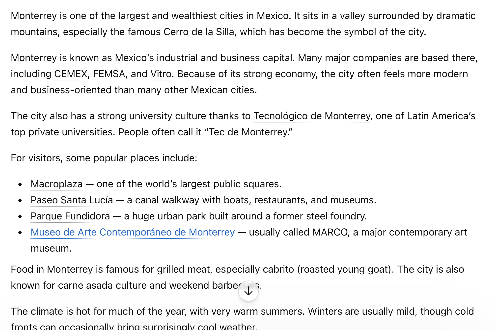
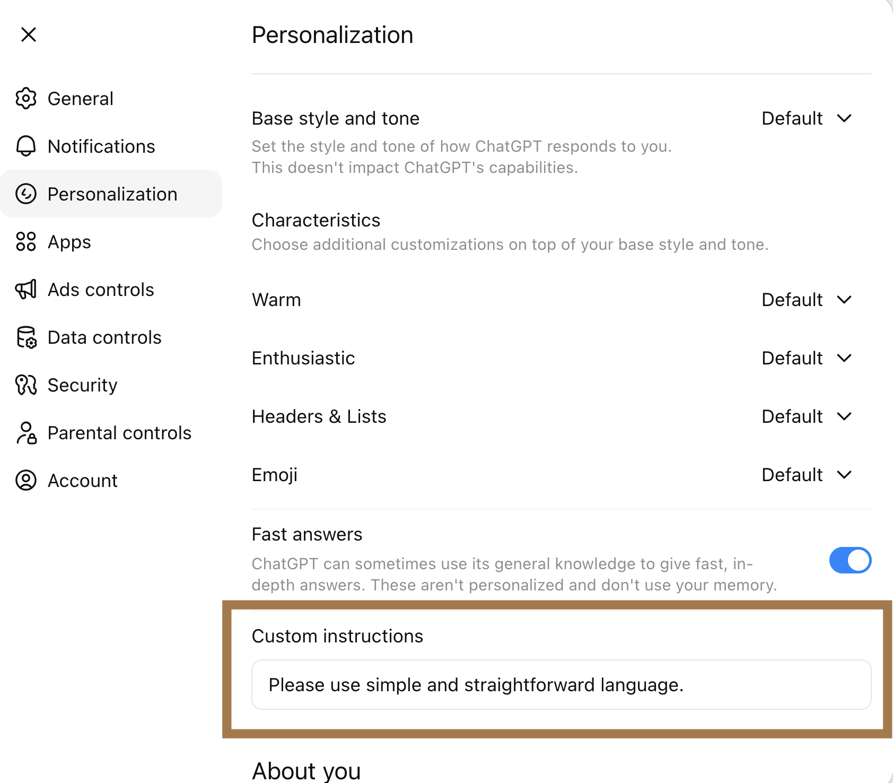
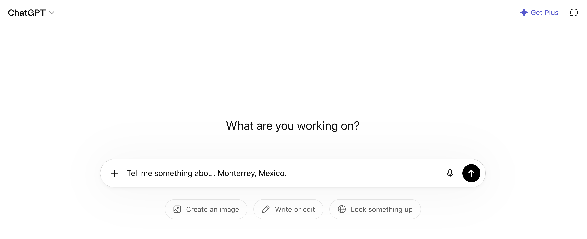
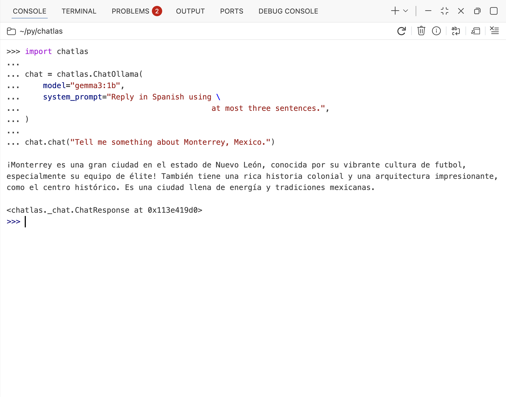
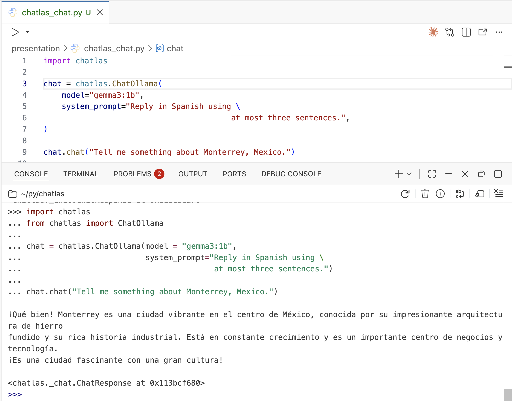
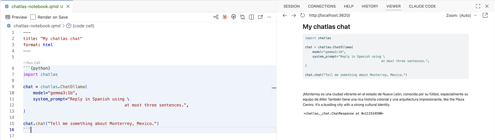
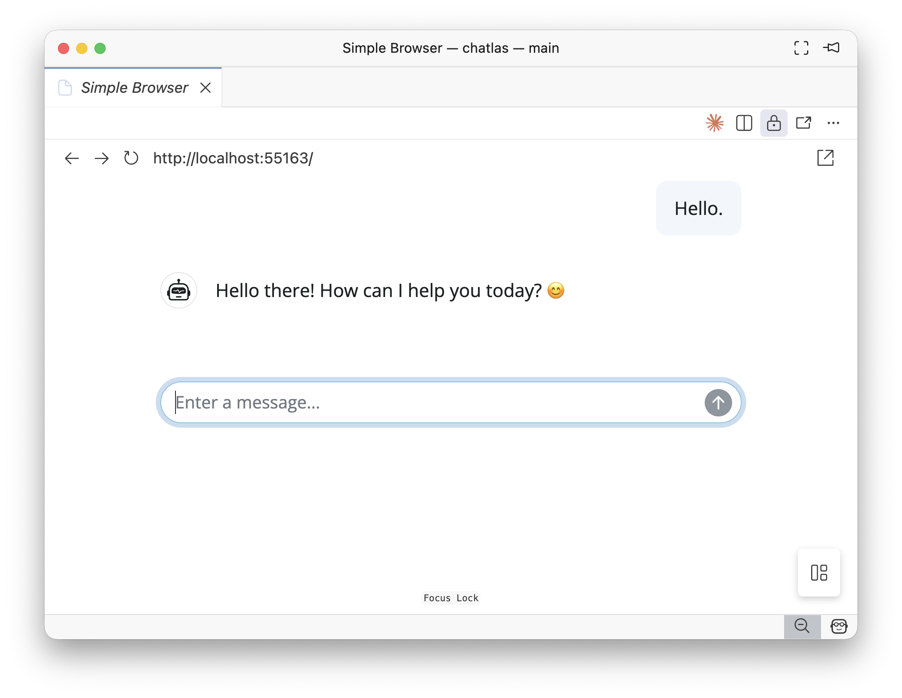

## Introduction

<center>

{style="box-shadow: 5px 5px 15px rgba(0, 0, 0, 0.3); border-radius: 5px;" width=20% }

[ \@ivelasq](https://github.com/ivelasq)

[ \@ivelasq3](https://bsky.app/profile/ivelasq3.bsky.social)

[ \@ivelasq3](https://fosstodon.org/@ivelasq3)

[ ivelasq.rbind.io](https://ivelasq.rbind.io)

</center>

## Overview

* What are large language models (LLMs)?
* Connecting Python with LLMs using chatlas
* Key features: providers, tools, streaming, and multi-modal input
* Practical examples and use cases

::: notes
Welcome! Today we'll explore how to use LLMs in your Python code. We'll start with the basics, then see how chatlas makes it easy to build your own AI-powered applications.
:::

# Quick introduction to LLMs {background-image="images/section-slide.png"}

## What are Large Language Models?

::: incremental
* **LLM** = Large Language Model
* AI models trained on massive amounts of text (books, websites, code)
* Can understand and generate human-like text
* Power tools you already use: ChatGPT, Claude, Gemini
* **Today:** Learn how to connect your Python code to LLMs
:::

::: notes
You've probably used ChatGPT or similar tools. Today we'll go beyond the web interface and learn how to integrate these models directly into your Python code. This opens up possibilities for automation, custom workflows, and building your own AI-powered tools.
:::

## How do they work?


{.fragment}

::: notes
LLMs work through conversation. You send a message, the model processes it and generates a response. Each interaction builds on the previous ones, creating a conversation with context.
:::

## How do they work?

{fig-align="center" style="box-shadow: 5px 5px 15px rgba(0, 0, 0, 0.3); border-radius: 5px;"}

::: notes
The system prompt is where you, as the developer, set the behavior and personality of the assistant. It's like giving the model instructions before the conversation starts. This is how you customize the AI for your specific use case.
:::

## Message roles

| Role        | Description                                                       |
|:-----------|:---------------------------------------------------------------|
| `system_prompt` | Instructions from the developer (that's you!) to set the behavior of the assistant |
| `user`       | Messages from the person interacting with the assistant        |
| `assistant`  | The AI model's responses to the user                           |

::: notes
Every conversation has three types of messages. System prompts set the rules, user messages are the questions or requests, and assistant messages are the responses. Understanding these roles helps you structure your interactions effectively.
:::

# Interacting with LLMs {background-image="images/section-slide.png"}

## Turn-based conversation

{fig-align="center" style="box-shadow: 5px 5px 15px rgba(0, 0, 0, 0.3); border-radius: 5px;"}

::: notes
We're all familiar with using ChatGPT through a web browser. You type a message, get a response, and continue the conversation. But what if you want to do this from your own code?
:::

## Programmatic chat clients

```python
from chatlas import ChatOpenAI

chat = chatlas.ChatOpenAI()

chat.chat("Tell me something about Monterrey, Mexico.")
```

::: notes
Beyond using LLMs in a browser, you can interact with LLMs programmatically.
:::

## Programmatic chat clients

::: incremental
- Use provider SDKs (OpenAI, Anthropic, Google)
- LangChain
- LlamaIndex
- Haystack
- **chatlas**
:::

::: notes
There are several ways to work with LLMs in Python. You can use low-level provider SDKs, which give you control but require more setup. Or you can use full-featured frameworks like LangChain, which are powerful but can be complex for simple tasks. chatlas aims for a middle ground - simple enough to get started quickly, but flexible enough to handle real applications.
:::

# Introducing chatlas

{fig-align="center"}

::: footer
[chatlas documentation](https://posit-dev.github.io/chatlas/)
:::

## Why chatlas?

::: incremental
* **Simple** - Clean API, minimal boilerplate, quick to learn
* **Multi-provider** - Switch between OpenAI, Anthropic, Google, Ollama
* **Tool calling** - Let LLMs execute your Python functions
* **Rich content** - Text, images, PDFs, structured JSON
* **Stateful** - Automatic conversation history tracking
:::

::: notes
chatlas was designed to make LLM integration straightforward. You don't need to learn complex abstractions or wade through configuration files. It handles common tasks like conversation history automatically, while still giving you access to advanced features when you need them.
:::

## Using chatlas

```{.python code-line-numbers="|1|3|5"}
from chatlas import ChatOllama

chat = chatlas.ChatOllama(model = "gemma3")

chat.chat("Tell me something about Monterrey, Mexico.")
```

. . .


```
Okay, let's dive into Monterrey, Mexico! It's a really fascinating and rapidly growing city with
a unique blend of industrial power, stunning natural beauty, and a thriving cultural scene.
Here’s a breakdown of what makes it interesting:

1. The Industrial Heart of Mexico:

 • Manufacturing Hub: Monterrey is the undisputed center of Mexico's automotive industry. It's
   home to the largest automotive factory complex in the world – the Grupo Ángeles (Angels Group)
   plant – which produces a huge percentage of vehicles sold in North America. This has made it
   incredibly important for Mexico’s economy.
 • Beyond Autos: However, Monterrey is diversifying. It’s a major center for manufacturing in
   glass, steel, and electronics, as well as food processing and pharmaceuticals.
 • Strategic Location: Its location on the Gulf of Mexico makes it a crucial trade and
   transportation hub for the region.

2. Stunning Geography & Landscape:

 • Mountains & Coastline: Monterrey sits in a valley surrounded by the majestic Sierra Madre
   Occidental mountains. The city offers incredible views of the coastline - the Bay of the
   Hudson.
 • Lake Rocío: A vast lake sits just south of the city, providing a scenic landscape and
   recreational opportunities.
 • Natural Parks: Nearby are national parks like El Chorro and El Macầu, offering hiking,
   birdwatching, and stunning natural areas.

3. Culture & Why It’s Becoming Popular:

 • Modern & Trendy: Monterrey has undergone a massive revitalization in recent decades,
   attracting a creative vibe and a young, stylish population.  It’s a place where you’ll find
   art galleries, trendy boutiques, and a lively nightlife.
 • Music & Arts: Monterrey has a booming music scene, with numerous venues hosting artists from
   various genres – rock, electronic, hip-hop, etc. The city is known for its creativity and
   musical energy.
 • Food Scene: The city's culinary scene has exploded in recent years. You’ll find a fantastic
   mix of Mexican cuisine, international flavors, and innovative restaurants.
 • Historical Significance: While known for its industrial pulse, the city has a rich history
   dating back to the 18th century, and there are some interesting museums and historic sites.

4. Some Key Facts & Statistics:

 • Population: Around 2.5 million (making it one of the largest cities in Mexico)
 • GDP: High, significantly contributing to Mexico’s overall economic growth.
 • Currency: Mexican Peso (MXN)

5.  Things to See & Do:

 • The Plaza Grande: The main square, bustling with activity.
 • The Museo de la Historia de Monterrey: A must-visit for history enthusiasts.
 • The "The Gate" Bridge: An iconic and impressive modern bridge.
 • The Rosedal Park: A massive park with a Japanese-style garden.
 • Museo de Arte Contemporáneo de Monterrey (MAC): A significant art museum.

Resources for Further Research:

 • Wikipedia - Monterrey: https://en.wikipedia.org/wiki/Monterey
 • Mexico Tourism: https://www.visitmexico.com/city/monterrey
```

::: footer
[Setting up local LLMs for R and Python](https://posit.co/blog/setting-up-local-llms-for-r-and-python)
:::

::: notes
Here's a complete example - import chatlas, create a chat instance, and start chatting. Notice how natural it feels. You can use this in any Python environment - scripts, notebooks, or production applications. The response you see here is from a local model running on my machine through Ollama.
:::


## Adding a system prompt

```{.python code-line-numbers="4,5"}
from chatlas import ChatOllama

chat = chatlas.ChatOllama(model = "gemma3",
                          system_prompt="Reply in Spanish using \
                                         at most three sentences.")

chat.chat("Tell me something about Monterrey, Mexico.")
```

. . .


```
¡Monterrey es una ciudad vibrante en el centro de México, conocida por su fútbol, especialmente el equipo de élite. Tiene una rica historia colonial y una arquitectura impresionante, incluyendo el Palacio de Bellas Artes. También es un importante centro industrial y cultural, con una escena gastronómica notable.
```

::: notes
System prompts let you customize the behavior. Here, we're asking for Spanish responses limited to three sentences. The model follows these instructions automatically. This is useful for controlling output format, tone, length, or language.
:::

## Using chatlas in the console

{fig-align="center" style="box-shadow: 5px 5px 15px rgba(0, 0, 0, 0.3); border-radius: 5px;"}

::: notes
chatlas works in the Python console for quick experimentation.
:::

## Using chatlas in a script

{fig-align="center" style="box-shadow: 5px 5px 15px rgba(0, 0, 0, 0.3); border-radius: 5px;"}

::: notes
You can use it in scripts for automation and batch processing.
:::

## Using chatlas in a notebook

{fig-align="center" style="box-shadow: 5px 5px 15px rgba(0, 0, 0, 0.3); border-radius: 5px;"}

::: notes
And it integrates nicely with Jupyter notebooks for exploratory work and documentation.
:::

# Providers and models {background-image="images/section-slide.png"}

## {.center}

::: {.r-fit-text .incremental}
**Provider**
:    company that hosts and serves models
:::

::: {.r-fit-text .incremental}
**Model**
:    a specific LLM with particular capabilities
:::

::: notes
Before we dive deeper, let's clarify some terminology. A provider is a company like OpenAI or Google that hosts AI models. A model is the specific AI you're using, like GPT-4 or Claude. Different models have different strengths, costs, and capabilities.
:::

## {.smaller}

| Provider | Example Models |
|----------|----------------|
| OpenAI | `gpt-4o`, `gpt-4-turbo`, `gpt-3.5-turbo` |
| Anthropic | `claude-3-5-sonnet-20241022`, `claude-3-opus-20240229` |
| Google | `gemini-1.5-pro`, `gemini-1.5-flash` |
| Azure OpenAI | `gpt-4`, `gpt-35-turbo` |
| Ollama | `llama3.2`, `gemma2`, `mistral` |
| Groq | `llama-3.3-70b-versatile`, `mixtral-8x7b-32768` |
| Databricks | `databricks-meta-llama-3-1-70b-instruct` |
| Together | `meta-llama/Meta-Llama-3.1-70B-Instruct-Turbo` |
| Perplexity | `llama-3.1-sonar-large-128k-online` |
| GitHub | `gpt-4o`, `claude-3.5-sonnet` |
| Bedrock | `anthropic.claude-3-5-sonnet-20241022-v2:0` |

::: notes
chatlas supports all of these providers. You can use commercial APIs like OpenAI and Anthropic, run models locally with Ollama, or use enterprise services like Bedrock. This flexibility means you can start with one provider and switch to another without rewriting your code.
:::

## How are models different?

::: incremental
1. **Content:** How many tokens can you give the model?
1. **Speed:** How many tokens per second?
1. **Cost:** How much does it cost to use the model?
1. **Intelligence:** How smart is the model?
1. **Capabilities:** Vision, reasoning, tools, etc.
:::

::: notes
Models differ in several ways. Context length determines how much text you can give them - newer models can handle up to a million tokens. Speed varies widely - some models prioritize fast responses, others prioritize quality. Cost ranges from a few dollars per million tokens for large models to nearly free for smaller ones. Intelligence is harder to quantify, but generally refers to reasoning ability and accuracy. Finally, capabilities include things like vision support, tool calling, and structured output. When choosing a model, consider what matters most for your use case.
:::

## {#chatlas .center transition="fade"}

::::: {style="display: flex; flex-direction: row; align-items: center; gap: 1em;"}
:::: {.column}
::: {style="text-align: center; width: 400px;"}
**chatlas**

{width="300px"}
:::
::::

:::: {.column}
**Providers**

* `ChatOpenAI()`

* `ChatAnthropic()`

* `ChatGoogle()`

**Local models**

* `ChatOllama()`

**Enterprise**

* `ChatBedrockAnthropic()`
::::
:::::

::: footer
<https://posit-dev.github.io/chatlas/get-started/models.html>
:::

## Multiple providers

Switch between LLM providers seamlessly:

::: {.panel-tabset}

### OpenAI
```python
from chatlas import ChatOpenAI
chat = ChatOpenAI(model="gpt-4")
```

### Anthropic
```python
from chatlas import ChatAnthropic
chat = ChatAnthropic(model="claude-sonnet-4-6")
```

### Google
```python
from chatlas import ChatGoogle
chat = ChatGoogle(model="gemini-2.0-flash-exp")
```

### Ollama (local)
```python
from chatlas import ChatOllama
chat = ChatOllama(model="gemma3")
```

:::

::: notes
Switching between providers is as simple as changing the import. The API stays consistent across providers, so you can experiment with different models without rewriting your code. This is especially useful for testing or when you want to compare results.
:::

## Switching providers

```{.python code-line-numbers="|3|5,6,10|7|"}
import chatlas
import os
from chatlas import ChatAnthropic  # requires anthropic package

chat = chatlas.ChatAnthropic(
       model="claude-sonnet-4-6",
       api_key=os.getenv("ANTHROPIC_API_KEY"),
       system_prompt="Reply in Spanish using \
                   at most three sentences.",
)

chat.chat("Tell me something about Monterrey, Mexico.")
```

. . .

```
Monterrey es la capital del estado de Nuevo León y es considerada una de las ciudades más industriales y económicamente importantes de México. Es conocida por su impresionante paisaje montañoso, especialmente el icónico Cerro de la Silla, que simboliza la ciudad. Además, Monterrey es reconocida por su vibrante cultura, su gastronomía y sus importantes universidades, como el Tecnológico de Monterrey.
```

::: notes
Here we're using Anthropic's Claude and passing our API key from an environment variable. Same system prompt as before, but now with a different provider. The experience is consistent regardless of which model you choose.
:::

# Tool calling {background-image="images/section-slide.png"}

## Accessing external functions

```python
chat = chatlas.ChatAnthropic()
chat.chat("How's the weather in Monterrey, Mexico?")
```

. . .

```
I don't have access to real-time weather data, so I can't tell you the current conditions in Monterrey,
Mexico.

However, I can share that Monterrey typically has:

 • Hot summers (May-September) with temperatures often exceeding 95°F (35°C)
 • Mild winters (December-February) with temperatures around 50-70°F (10-21°C)
 • Low rainfall overall, though most rain falls June-September
 • Semi-arid climate with plenty of sunshine year-round

For current conditions, I'd recommend checking:

 • Weather.com
 • Weather apps on your phone
 • Local Monterrey news websites
 • Google weather search

Is there something specific about Monterrey's weather you'd like to know about?
```

::: notes
Here's a common limitation - LLMs don't have access to real-time data. When you ask about current weather, they can only provide general information. But we can fix this with tool calling.
:::

## Accessing external functions

Create a tool function:

```python
import requests

def get_current_weather(lat: float, lng: float):
    """
    Get the current weather given a latitude and longitude.

    Parameters
    ----------
    lat: The latitude of the location.
    lng: The longitude of the location.
    """
    lat_lng = f"latitude={lat}&longitude={lng}"
    url = f"https://api.open-meteo.com/v1/forecast?{lat_lng}&current=temperature_2m,wind_speed_10m&hourly=temperature_2m,relative_humidity_2m,wind_speed_10m"
    response = requests.get(url)
    return response.json()["current"]
```

::: notes
Tool calling lets the LLM use your Python functions. Here's a simple weather function that calls an API. The key is the docstring - it tells the model what this function does and what parameters it needs. chatlas automatically converts this into a format the model can understand.
:::

## Accessing external functions

Register and call the tool:

```python
chat.register_tool(get_current_weather)

chat.chat("How's the weather in Monterrey, Mexico?")
```


```
# 🔧 tool request (toolu_01MgUEzjRnY9Sx1TJREebgTJ)
 get_current_weather(lat=25.6866, lng=-100.3161)

# ✅ tool result (toolu_01MgUEzjRnY9Sx1TJREebgTJ)
 { 'time': '2026-05-09T13:00',
   'interval': 900,
   'temperature_2m': 23.1,
   'wind_speed_10m': 4.5}

The current weather in Monterrey, Mexico is:

 • Temperature: 23.1°C (about 74°F)
 • Wind Speed: 4.5 km/h (light breeze)
 • Time: 1:00 PM local time

It's a pleasant day in Monterrey with comfortable temperatures and light winds!
```

::: notes
Watch what happens now. The model recognizes it needs weather data, calls our function with Monterrey's coordinates, gets the real-time results, and incorporates them into a natural response. This is the power of tool calling - your LLM can now interact with any API or data source you provide.
:::

# Multi-modal input

## Image input

{width=200px}

```{.python code-line-numbers="|1|4|5|"}
chat = chatlas.ChatOllama(model="llava")

chat.chat(
  chatlas.content_image_file("./images/View_of_Monterrey.jpg"),
  "Can you explain this image? Be concise."
)
```

. . .

```
The image shows a scenic view of a city with a large volcanic mountain in the
background, on which a city is nestled. There's a clear sky above, and some
clouds are scattered. In the foreground, there appears to be a body of water
reflecting the sky. The photo seems to have been taken from a distance and
captures both urban development and natural landscape elements coexisting.
```

::: notes
chatlas can handle images too. You pass an image file and ask questions about it. This works with vision-capable models. Note that the model here got some details wrong - this is actually a view of Monterrey, not Popocatépetl - but it demonstrates the capability.
:::

## PDF input

```{.python code-line-numbers="|1|4|5|"}
chat = chatlas.ChatOllama(model="llava")

chat.chat(
  chatlas.content_pdf_file("./images/data-projects-in-monterrey-mexico.pdf"),
  "What are the main findings in this report? Be concise."
)
```

```
The image displays a natural landscape with a large, rounded mountain situated near what appears to be an
urban area. In the foreground are various trees and clouds, giving the impression of a hazy or overcast day.
Behind the trees, we can see a cityscape of buildings at varying distances, culminating in the tallest
structures that resemble those in a major metropolitan area with high-rise constructions. In the distant
background, centered among the clouds, is a mountain peak that stands out due to its relative height and
isolation. The top right corner features an image of a volcano-like mountain on a glossy surface, suggesting
the photo may have been taken from a screen or print. This is a cityscape as viewed looking toward the coast
or another body of water, with the natural scenery providing a serene counterpoint to the bustling urban
environment below.
```

::: notes
PDFs work similarly - just pass the file path or URL. This is useful for processing research papers, reports, or invoices. You can ask questions about the content or extract specific information. Not all models support PDFs, so check your provider's documentation.
:::

# Streaming {background-image="images/section-slide.png"}

## Responding one chunk at a time

```python
chat = chatlas.ChatOllama(model="gemma3")

stream = chat.stream("My name is Isabella.")

for chunk in stream:
    print(chunk)
```

::: notes
Streaming lets you see responses as they're generated, word by word. This creates a better user experience for chat interfaces - users see progress immediately rather than waiting for the complete response. It's the same experience you get with ChatGPT.
:::

```
That
'
s
 a
 cool
 name
,
 Isabella
!
 It
 has
 a
 nice
 sound
 to
 it
.
 😊


Is
 there
 anything
 you
'
d
 like
 to
 talk
 about
,
 or
 were
 you
 just
 letting
 me
 know
 your
 name
?
```

# Chat history {background-image="images/section-slide.png"}

## Remembering past interactions

```python
chat.chat("What's my name?")
```

```
Your name is Isabella! 😊 I asked you what your name was earlier.

It's a bit of a trick question! 😄

Would you like to tell me something about yourself, Isabella?
```

::: notes
chatlas automatically maintains conversation history. When you ask "What's my name?", it remembers that you introduced yourself earlier. You don't need to manually manage context - it just works. This makes building conversational applications much simpler.
:::

# Practical examples and use cases {background-image="images/section-slide.png"}

## Example: Batch document summarization

Process dozens of research papers and create a summary CSV:

```{.python code-line-numbers="|1-5|7-12|14-20|22-23"}
from pathlib import Path
from pydantic import BaseModel
import pandas as pd

chat = chatlas.ChatGoogle(model="gemini-1.5-flash")

class Paper(BaseModel):
    """Extract key information from this research paper."""
    title: str
    authors: list[str]
    year: int
    key_findings: str  # 1-2 sentences

# Process all PDFs in a folder
papers = []
for pdf_path in Path("research_papers/").glob("*.pdf"):
    result = chat.chat_structured(
        chatlas.content_pdf_file(pdf_path), data_model=Paper
    )
    papers.append(result.model_dump())

# Save to CSV for analysis
df = pd.DataFrame(papers)
df.to_csv("paper_summaries.csv", index=False)
```

::: notes
Here's a practical example - processing a folder full of research papers. You define what information you want to extract using a Pydantic model, then loop through all the PDFs. chatlas extracts the structured data from each one, and you save it as a CSV. Something that would take hours of manual work becomes a short script that runs in minutes.
:::


## Creating a chatbot with chatlas with Shiny

```{.python filename="app.py"}
from chatlas import ChatOllama
from shiny.express import ui

chat = ui.Chat(
    id="ui_chat"
)
chat.ui()

chat_model = ChatOllama(model = "gemma3:1b")

@chat.on_user_submit
async def handle_user_input():
    response = chat_model.stream(chat.user_input())
    await chat.append_message_stream(response)
```

## Creating a chatbot with chatlas with Shiny

{fig-align="center"}

## Why build with chatlas?

**Generic chatbot (ChatGPT, Claude):**

❌ Can't access your local data

❌ Can't query your databases

❌ Can't integrate with your APIs

❌ Can't automate workflows

. . .

**Custom chatbot with chatlas:**

✅ Works with YOUR data

✅ Integrates with YOUR tools

✅ Automates YOUR workflows

::: notes
This is the key difference. ChatGPT is great for general questions, but it knows nothing about your specific data. With chatlas, you can build assistants that work with your organization's information, call your APIs, and automate your workflows. Let's see a concrete example.
:::

## Example: PyLadies Monterrey event assistant

What if you could ask questions about local events?

::: incremental
- "What events do we have about AI?"
- "Tell me about the TEC de Monterrey venue"
- "What's our average event attendance?"
:::

. . .

**This requires integration with local data!**

::: notes
Imagine having an assistant that knows about PyLadies Monterrey events. You could ask about upcoming workshops, venue details, or attendance patterns. ChatGPT can't answer these questions because it doesn't know about your local data. But with chatlas, we can build this.
:::

## Connect the chatbot to your data

```{.python filename="app.py" code-line-numbers="|1-12|15-21|24-27"}
# Your local event database
EVENTS = [
    {
        "name": "Python & LLMs Workshop",
        "date": "2026-05-09",
        "location": "TEC de Monterrey",
        "attendees": 45,
        "topic": "chatlas and AI"
    },
    # ... more events
]

def get_upcoming_events(topic: str = None):
    """
    Get upcoming PyLadies Monterrey events.

    Parameters
    ----------
    topic : Filter by topic (e.g., "AI", "data", "web")
    """
    return [e for e in EVENTS if topic.lower() in e["topic"].lower()]

chat = chatlas.ChatAnthropic(model="claude-sonnet-4-5")
chat.register_tool(get_upcoming_events)

# Now it can answer questions about YOUR events!
chat.chat("What events do we have about AI?")
```

::: notes
The solution is straightforward. You have your event data in a Python data structure. You write a function that searches it. You register that function with chatlas. Now when someone asks about events, the LLM can call your function to get the answer. The docstring helps the model understand when and how to use the tool.
:::

## The chatbot uses your function

```
# 🔧 tool request
 get_upcoming_events(topic='AI')

# ✅ tool result
 [{'name': 'Python & LLMs Workshop',
   'date': '2026-05-09',
   'location': 'TEC de Monterrey',
   'attendees': 45,
   'topic': 'chatlas and AI'}]

¡Hay un evento sobre IA! Es el "Python & LLMs Workshop" que se
llevará a cabo el 9 de mayo de 2026 en el TEC de Monterrey.
Ya hay 45 personas registradas. ¿Te gustaría más detalles?
```

::: notes
Here's what happens behind the scenes. The user asks about AI events. The model recognizes it needs to call our function. It calls it with "AI" as the topic. The function returns the matching event data. The model takes that data and crafts a friendly, bilingual response. All of this happens automatically.
:::

## Building custom chatbots with Shiny

Add the tools to a Shiny chat interface:

```{.python code-line-numbers="|1-2|4-8|10-14|16-18"}
from chatlas import ChatAnthropic
from shiny.express import ui

# Create chat UI
chat = ui.Chat(id="chat", messages=[
    {"role": "assistant",
     "content": "¡Hola! Ask me about PyLadies Monterrey events!"}
])
chat.ui()

# Create chatbot with registered tools
chat_model = ChatAnthropic(model="claude-sonnet-4-5")
chat_model.register_tool(get_upcoming_events)
chat_model.register_tool(get_venue_info)

@chat.on_user_submit
async def handle_user_input():
    await chat.append_message_stream(chat_model.stream(chat.user_input()))
```

::: notes
We can take this further by adding a web interface with Shiny. Shiny provides the chat UI, chatlas handles the LLM interactions. We register our tools, set up a handler for user input, and we have an interactive web application. Let's see it in action.
:::

## Demo time! {.center}

::: {.r-fit-text}
PyLadies Monterrey Event Assistant
:::

## Other use cases

::: incremental
- **Data analysis**: Query databases, generate reports
- **Document processing**: Extract info from PDFs, summarize research
- **API integration**: Check weather, send emails, post to Slack
- **Workflow automation**: Schedule tasks, monitor systems
- **Custom agents**: Code review bots, customer support, tutoring
:::

::: notes
The PyLadies event assistant is just one example. You can use chatlas for data analysis tasks, processing documents at scale, integrating with external APIs, automating workflows, or building specialized agents. The common thread is connecting LLMs to your specific tools and data.
:::

::: notes
[Structured data](https://posit-dev.github.io/chatlas/get-started/structured-data.html)
:::

## Next steps

::: incremental
- **MCP (Model Context Protocol)**: Connect LLMs to data sources, APIs, and tools using a standardized protocol
- **RAG (Retrieval Augmented Generation)**: Ground responses in your documents and knowledge bases
- **Evals**: Test and measure your LLM applications to ensure quality and reliability
:::

::: notes
Once you’re comfortable with the basics, there are powerful techniques to explore. MCP lets you build reusable connections to data sources. RAG helps LLMs answer questions based on your specific documents. And evals help you systematically test and improve your applications. These are the building blocks for production-grade LLM systems.
:::

## Acknowledgements and resources

* [Programming with LLM APIs: A Beginner’s Guide in R and Python](https://posit-conf-2025.github.io/llm/)
* [Harnessing LLMs for Data Analysis | Led by Joe Cheng, CTO at Posit](https://www.youtube.com/watch?v=owDd1CJ17uQ)
* [Putting an {ellmer} AI in production with the blessing of IT (Andrie de Vries) | posit::conf(2025)](https://www.youtube.com/watch?v=5jQ7UjegpP0)

::: notes
Thanks for joining today! Here are some resources to continue learning. The first link is a comprehensive workshop covering chatlas and its R equivalent, ellmer. The videos show real-world applications and deployment strategies. All the code from today’s presentation is available in the chatlas repository. Feel free to reach out with questions!
:::
